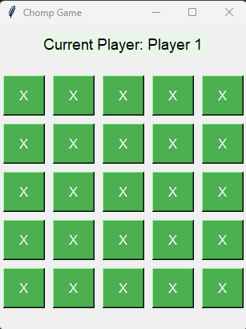
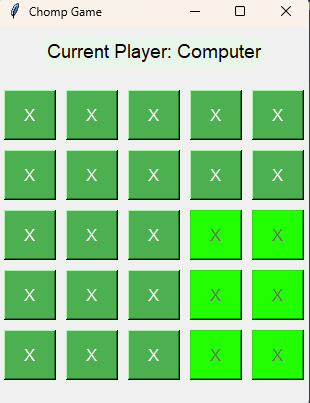
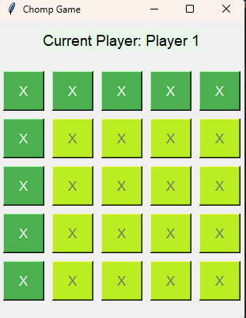
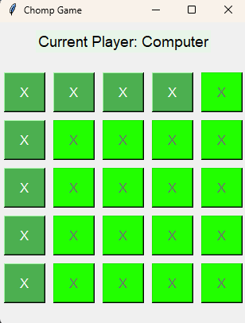
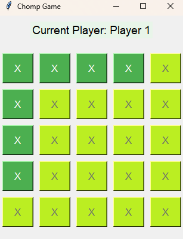
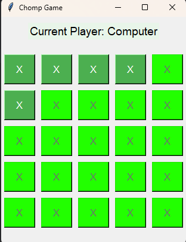
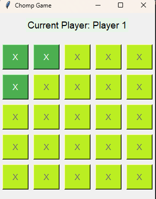
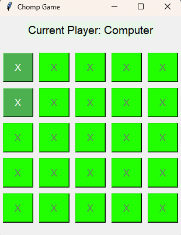
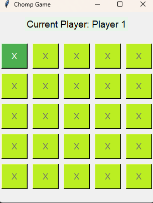
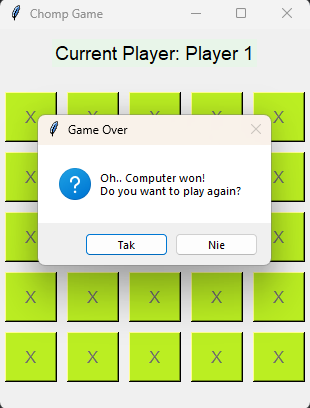

# Authors 
Jakub Pobłocki  
Kacper Pecka

# Rules of Chomp

## Objective
The goal of the game is to force your opponent to eat the last "square" (element) on the board.

## Setup
1. **Board**: The game is played on a rectangular board made up of squares, resembling a chocolate bar. A typical size is 5x5, but different sizes can be used ranging from 2x2 to 5x5.
2. **Gameplay Rules**: Each square on the board can be eaten, and when a square is eaten, all squares to the right and below that square are also removed.

## Gameplay
1. **Moves**: Players take turns making moves. On their turn, a player chooses a square to eat.
2. **Eating Rules**: When a square (e.g., at position x, y) is eaten, all squares in the same row to the right (including the chosen square) and in the same column below (including the chosen square) are also removed from the board.
3. **End of Game**: The game ends when one player cannot make a move, which means they had to eat the last square. That player loses.

## Example Move
If there is a board size ranging from 2x2 to 5x5, and a player chooses the square at position (2, 2), they will eat all squares to the right and down from this block.

## Example Gameplay

Below are examples of gameplay in Chomp, showing consecutive moves.

| Move 1 | Move 2 | Move 3 | Move 4 | Move 5 |
|--------|--------|--------|--------|--------|
|  |  |  |  |  |
| Move 6 | Move 7 | Move 8 | Move 9 | Move 10 |
|  |  |  |  |  |

## Strategy
- Pay attention to the moves you leave for your opponent.
- Try to force your opponent into a position where they have to eat the last square.

# Setting Up the Chomp Game in Python

## Prerequisites
- Ensure that Python is installed on your computer. You can download it from [python.org](https://www.python.org/downloads/).

## Required Libraries
Make sure you have the following libraries installed:

- `easyAI`
- `tkinter` (this is usually included with Python)

You can install the required libraries using the command:

```bash
pip install easyAI
```